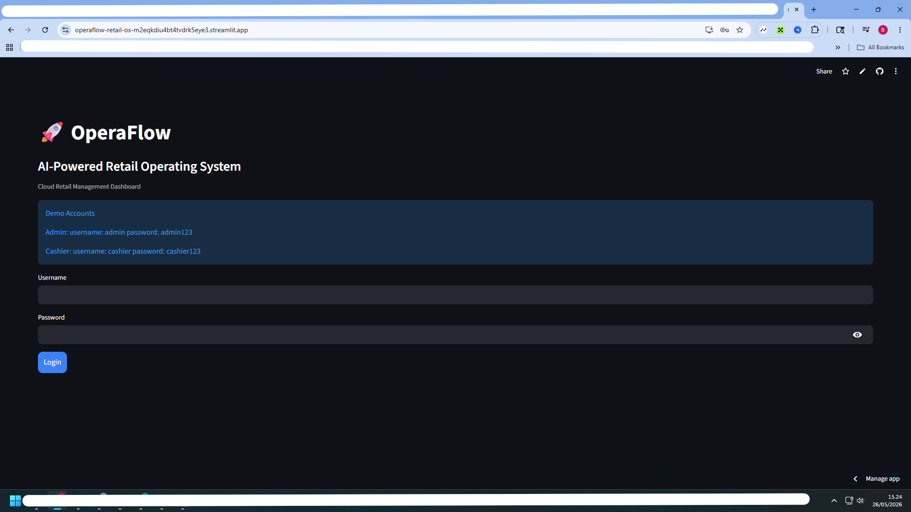
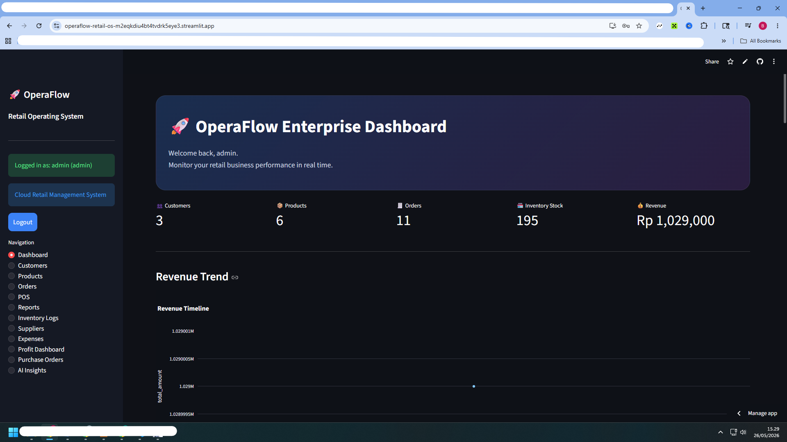
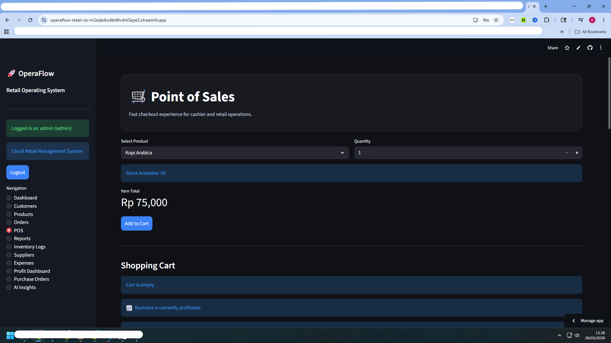
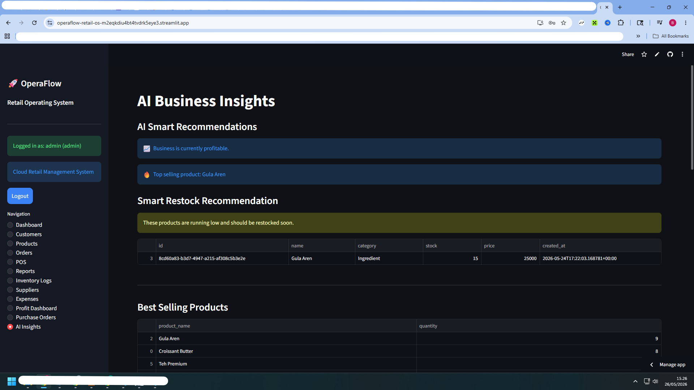
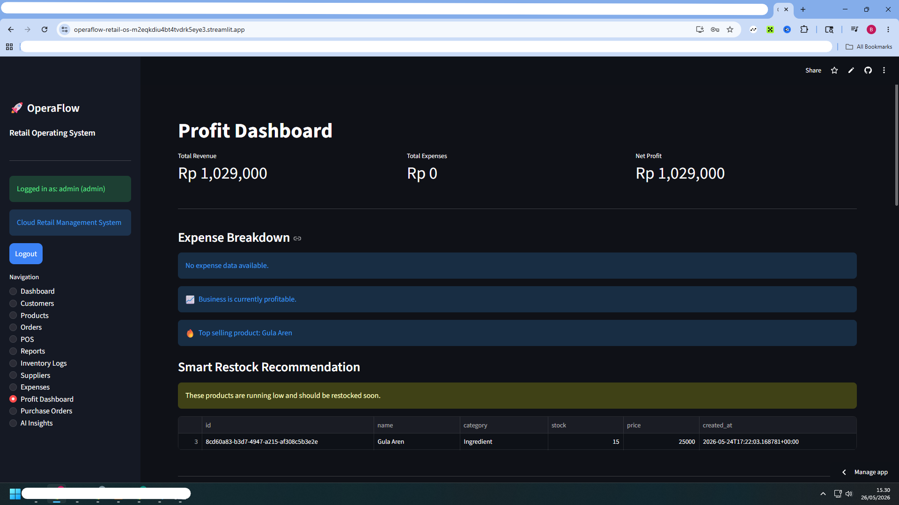

# 🚀 OperaFlow Retail OS

AI-Powered Retail Operating System built with Streamlit + Supabase.

OperaFlow is a modern retail management platform designed for small and medium businesses.  
The system combines POS, inventory management, AI insights, analytics dashboards, supplier management, and business reporting into a single cloud-based platform.

---

# ✨ Features

## 🛒 Point of Sales (POS)
- Fast cashier workflow
- Shopping cart system
- Real-time stock updates
- Receipt generation
- PDF receipt download

---

## 📦 Inventory Management
- Product management
- Real-time inventory tracking
- Restock products
- Inventory movement logs
- Low stock alerts

---

## 👥 Customer Management
- Customer database
- Customer information tracking

---

## 🏭 Supplier Management
- Supplier database
- Supplier categorization

---

## 📑 Purchase Order System
- Create purchase orders
- Supplier-to-product workflow
- Automatic stock updates after receiving goods

---

## 💸 Expense Tracking
- Business expense management
- Expense categorization
- Financial tracking

---

## 📊 Executive Analytics Dashboard
- Revenue analytics
- Expense analytics
- Profit dashboard
- KPI metrics
- Revenue trend visualization
- Top selling products analytics

---

## 🤖 AI Business Insights
- Smart restock recommendations
- Best-selling product detection
- Slow-moving product analysis
- Financial health insights
- AI-generated business recommendations

---

## 📄 PDF Export System
- Receipt PDF export
- Sales report PDF export
- Inventory report PDF export
- Expense report PDF export

---

## 🔐 Role-Based Access
### Admin
- Full system access

### Cashier
- POS access
- Order access

---

# 🛠️ Tech Stack

- Python
- Streamlit
- Supabase
- Pandas
- Plotly
- FPDF

---

# ☁️ Deployment

Deployed with:
- Streamlit Cloud
- Supabase Cloud Database

---

# 📸 Screenshots

# 📸 Screenshots

## 🔐 Login Page

---

## 📊 Executive Dashboard

---

## 🛒 Point of Sales

---

## 🤖 AI Insights

---

## 💰 Profit Dashboard

## Login Page
Modern enterprise-style login interface.

## Executive Dashboard
Business intelligence dashboard with analytics and KPI cards.

## POS System
Fast cashier workflow with PDF receipt support.

## AI Insights
AI-powered recommendations for retail operations.

---

# 🚀 Future Improvements

- Multi-store support
- Employee attendance
- Advanced AI forecasting
- Barcode scanner integration
- WhatsApp invoice integration
- Customer loyalty system

---

# 👨‍💻 Developer

Built by Bonar Sulaiman

LinkedIn:
https://www.linkedin.com/in/bonarsulaiman

GitHub:
https://github.com/loctate/operaflow-retail-os

Streamlit:
https://operaflow-retail-os-m2eqkdiu4bt4tvdrk5eye3.streamlit.app/

---

# 📌 Project Status

✅ Production-ready portfolio project  
✅ AI-powered retail management system  
✅ Enterprise SaaS-style dashboard  